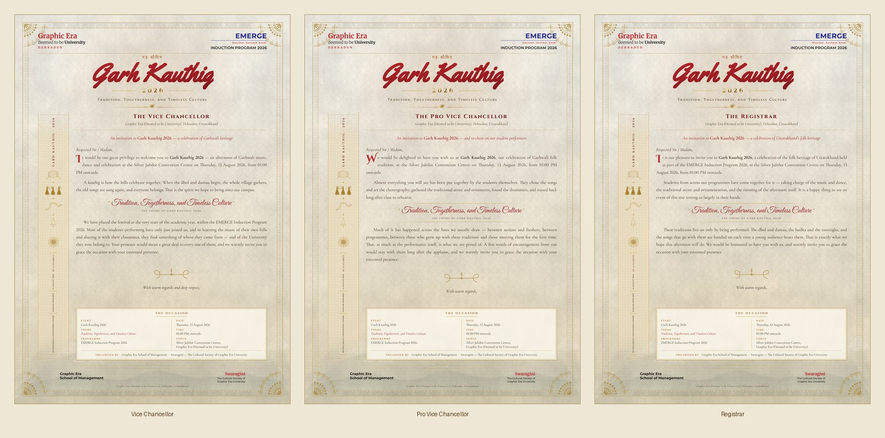

# Garh Kauthig 2026 — A3 Invitation Suite

Three luxury A3 ceremonial invitation letters for **Garh Kauthig 2026**, issued by
the Graphic Era School of Management with Swaragini, The Cultural Society of
Graphic Era University, under the EMERGE Induction Program 2026.

| Recipient | Register of the letter |
|---|---|
| Vice Chancellor | visionary — heritage, the university's role as custodian of culture, national values |
| Pro Vice Chancellor | warm — student creativity, leadership, collaboration across cohorts |
| Registrar | administrative — participation across programmes, institutional pride, preservation |



---

## Which file do I send to the printer?

Everything is in `output/print-ready/`.

| Folder | File | Use it when |
|---|---|---|
| `cmyk/` | `…-CMYK-A3-bleed.pdf` (~2 MB) | **Default choice.** DeviceCMYK, single page, 303 × 426 mm with TrimBox and BleedBox set. Hand this to most presses. |
| `with-crop-marks/` | `…-CMYK-cropmarks.pdf` | The press asks for trim marks. Same artwork on a 319 × 442 mm sheet with crop marks, a registration target and a CMYK tint strip in the slug. |
| `rgb/` | `…-RGB-A3-bleed.pdf` | The press prefers to run its own ICC conversion, or you are printing digitally / in-house. This is the colour master and is verified pixel-faithful to the design. |
| `cmyk-tiff/` | `…-CMYK-300dpi.tif` (28 MB) | Belt-and-braces. Flattened 300 dpi CMYK raster, ICC-converted, profile embedded — appearance cannot shift. Not committed to the repo; regenerate with `python3 src/make_cmyk_tiff.py`. |

`output/preview/` holds screen-sized JPEGs (bleed trimmed off) for circulating
internally and getting sign-off.

### Print specification

- **Trim size** A3 portrait, 297 × 420 mm
- **Sheet size** 303 × 426 mm — a full 3 mm bleed on all four edges
- **TrimBox / BleedBox** written into every PDF, so the RIP needs no instructions
- **Resolution** all type and ornament is live vector; the only raster is the
  paper-and-mountains background plate, at 300 dpi
- **Colour** DeviceCMYK on delivery; peak total area coverage 284 %, inside the
  usual 300–320 % ceiling for coated stock
- **Fonts** fully embedded and subset
- **Recommended stock** 300–350 gsm uncoated / textured natural white. The
  design already simulates a handmade paper surface, so a smooth gloss coat
  fights it.

---

## What came from the poster, and what deliberately did not

Every factual detail was transcribed from the supplied A3 poster and nothing was
invented:

> Garh Kauthig · *Tradition, Togetherness, and Timeless Culture* · August 13,
> 2026 · 01:00 PM Onwards · Silver Jubilee Convention Centre, Graphic Era
> (Deemed to be University) · Graphic Era School of Management · Swaragini, The
> Cultural Society of Graphic Era University · EMERGE Induction Program 2026,
> "Discover. Connect. Excel." · Dehradun

Three things the brief asked for are **absent because the poster does not carry
them**, and guessing would have been worse than omitting:

- **Dress code** — not on the poster.
- **Contact details / website** — not on the poster.
- **A session-by-session schedule.** The poster gives only a start time, so the
  side panel is headed *At a Glance* and repeats date, time and venue rather
  than pretending to a programme of sessions.

The poster also names **no Chief Guest or Inaugural Guest**. All three letters
therefore use neutral ceremonial wording — *"grace the occasion with your
esteemed presence"* — and none assigns that role.

### This reads as an invitation, not as an office letter

The formal letterhead apparatus has been deliberately stripped out: there is no
reference number, no dispatch date, no `To` block, no `Prof. (Dr.)` rule to fill
in by hand, and no row of coordinator signature placeholders. The filled maroon
bar that used to head the information box is gone too — it read as a stuck-on
rectangle rather than part of the sheet.

What identifies each letter is the addressee line — *The Vice Chancellor* — set
under the title, and the wording of the letter itself. Nothing on the sheet needs
completing by hand before it goes to print.

### About the logos

**No emblem is invented anywhere in this suite.** The header and footer reproduce
the poster's own lockups, set as type: *Graphic Era / deemed to be University /
DEHRADUN* and *EMERGE / Discover. Connect. Excel. / Induction Program 2026*
across the head, *Graphic Era School of Management* and *Swaragini, The Cultural
Society of Graphic Era University* across the foot.

**Before printing, drop the official artwork into
[`assets/logos/`](assets/logos/README.md)** using the file stems `geu`, `emerge`,
`gesm`, `swaragini`. The build detects them and replaces the type lockups
automatically — no code change needed. SVG is strongly preferred at A3.

---

## Design notes

- **Palette** royal maroon, deep crimson and the poster's own red, against
  antique gold, brass, copper, ivory and Himalayan green. No flat fills: the
  ground is a layered gradient, the metallics are gradient-filled.
- **Border** an embossed antique-gold double rule, carved wooden lintel bands
  top and bottom, ringaal (hill bamboo) weave down the sides, and an aipan-derived
  quarter mandala in each corner with a vine running out along the rules.
- **Background** ivory handmade-paper fibre with pulp inclusions, a watercolour
  Himalayan range at the foot, a low-opacity aipan lattice, a folk-textile band
  and a warm deckle vignette.
- **Ornament** dhol, damau, hudka, ransingha, temple bell, hill house with carved
  balcony, pines, prayer flags, kalash, traditional jewellery, and a jhora chain
  of three dancers with joined hands — all monochrome gold line art.
- **Typography** Yellowtail for the display script (chosen to echo the poster's
  own lettering), Cormorant Garamond for the body, Cinzel and Marcellus SC for
  small caps and designations, Great Vibes for the calligraphic pull quote, Noto
  Serif Devanagari for गढ़ कौथिग, and Merriweather / Montserrat for the
  institutional lockups.
- **Print effects** gold-foil gradients clipped to live glyphs, an embossed
  border with light and shadow offsets, textured stock and soft shadows on the
  information box. No filled colour panels anywhere: every accent is a rule, a
  gradient on type, or ornament.

---

## Editing

The layout is CSS in millimetres — 1 mm in `src/invitation.css` is 1 mm on the
sheet — so it is genuinely editable rather than a flattened export.

| I want to change… | Edit |
|---|---|
| letter wording, standfirst lines, event details | `src/content.js` |
| layout, palette, type scale, print effects | `src/invitation.css` |
| page structure, logo slots, side-panel icons | `src/build.mjs` |
| ornament and motif drawings | `src/make_ornaments.py` |
| paper / foil textures | `src/make_textures.py` |

```bash
./build.sh            # full rebuild: textures, ornaments, pages, PDFs, prepress
./build.sh --quick    # skip regenerating textures/ornaments/background plate
```

**Other applications.** The PDFs open in Illustrator with live, editable text and
vector ornament, and import into Figma the same way. For Photoshop or Canva, place
the 300 dpi raster. Word cannot reproduce this layout — send the PDF instead.

### Pipeline

```
make_textures.py ─┐
make_ornaments.py ─┼─> build.mjs ─> render.mjs ─> prepress.py ──> print-ready/
                   │   (HTML)       (Chromium:     (trim/bleed
   background plate┘                 vector PDF     boxes, CMYK,
   (baked once, 300 dpi)             + 300 dpi PNG)  crop marks)
```

Two details worth knowing if you modify the CSS:

- The background is **baked to a single flat image** on purpose. Blend modes,
  masks and filters were making Ghostscript drop the paper texture and mountains
  during CMYK conversion; flattening the background first means the CMYK file
  matches the RGB master. Keep new blend modes out of the foreground.
- A CSS `filter` on text forces Chromium to rasterise that heading. The
  letterpress effect is built from layered live text instead, which is why all
  type survives as vector.
- There is **no page-wide `text-shadow`**. Chromium emits a second copy of every
  glyph run to draw a shadow, which made all the text appear twice when copied
  out of the PDF (`REF. NO. … REF. NO. …`). Depth comes from the embossed rules
  and gradient-filled display type instead.
- Cormorant Garamond defaults to old-style figures, which rendered `01:00 PM` as
  `oi:oo PM`. `font-variant-numeric: lining-nums` is set on `.page`; keep it.

`render.mjs` fails loudly if any block overflows the printable frame, so a
too-long letter is caught at build time rather than at the printer.

---

## Licence

Typefaces are bundled under the SIL Open Font License 1.1 — see
[`assets/fonts/NOTICE.md`](assets/fonts/NOTICE.md) and
[`assets/fonts/OFL.txt`](assets/fonts/OFL.txt). All ornament, textures and layout
in this directory were generated for this project.
