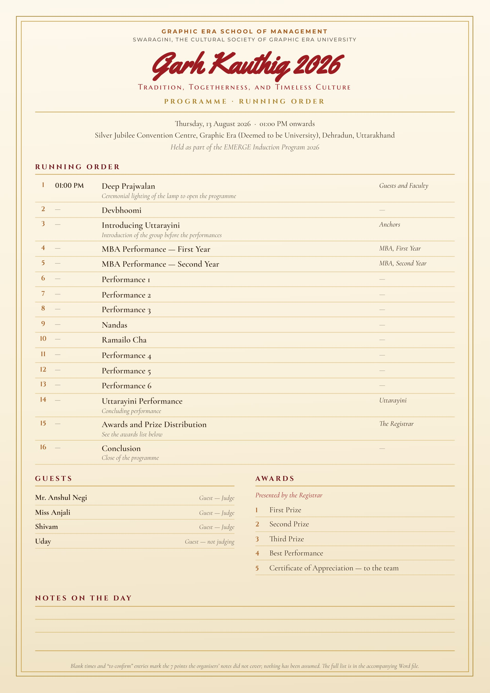

# Garh Kauthig 2026 — Programme / Itinerary

The running order, guests and awards, built from the organisers' notes.



## Which file do I use?

| File | Use it for |
|---|---|
| **`garh-kauthig-2026-itinerary.docx`** | **Editing.** Opens in Word, Google Docs or Pages. Tables are live — retype the times, rename the performances, drag rows around. |
| `garh-kauthig-2026-itinerary.pdf` | Circulating and printing. A4, designed to match the invitation suite. |
| `garh-kauthig-2026-itinerary.md` | Editing as plain text, if you prefer that to Word. |

## Nothing has been invented

The poster gives a **01:00 PM** start and no other timing, so the Time column is
deliberately blank rather than filled with plausible guesses. Anything the notes
did not settle is marked *to confirm* and listed under **To Confirm** in the Word
and Markdown files.

Seven points are open:

1. **Timings.** Give me the finish time, or a length per slot, and I will fill the
   whole column in.
2. **Performances 1–6** are unnamed — item and performers needed for each.
3. **Devbhoomi**, **Nandas**, **Ramailo Cha** — are these item titles, or the names
   of the performing teams?
4. *"Uttarayini (sth mein introduce)"* has been read as: Uttarayini is **introduced**
   before the performances and **performs** at the end. Please confirm where the
   introduction sits.
5. *"Deep Prajwalan by guests and facilities"* has been read as guests and
   **faculty**.
6. Anshul Negi, Anjali and Shivam are shown as **judges** because Uday is marked
   *not judge*. Please confirm, and add titles or surnames for Shivam and Uday.
7. The **anchors / compères** are not named.

## Regenerating

All three outputs come from one data block, so they cannot drift apart. Edit
`RUNNING_ORDER`, `GUESTS`, `AWARDS` or `QUERIES` at the top of
`make_itinerary.py`, then:

```bash
python3 make_itinerary.py     # writes the .docx, .md and .html
node render.mjs               # renders the .html to PDF + preview
```

`render.mjs` reports whether the content still fits the sheet, so an added row
cannot silently push the layout onto a second page.

Requires `python-docx` (`pip install python-docx`) and the Puppeteer install in
`../tools`. The designed sheet borrows its fonts from
`../garh-kauthig-2026-invitations/`, so keep the two folders side by side.
